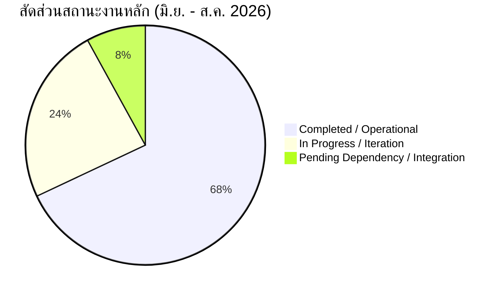

# รายงานการประเมินผลการปฏิบัติงานรอบครึ่งปี (Self-Assessment)
**ตำแหน่ง:** Operation Process Improvement Section Manager  
**รหัสพนักงาน:** 10005208 (คุณชัชวาลย์ ตุลาผล)  
**ฝ่าย/หน่วยงาน:** Improvement  
**สถานะผู้ใต้บังคับบัญชา:** มีผู้ใต้บังคับบัญชา (ดูแลทีม Section เพื่อ Coach / Follow-up / Delegate)  
**ช่วงเวลาการประเมิน:** 1 มิถุนายน 2026 – 31 สิงหาคม 2026 (June – August 2026)  
**แหล่งข้อมูลหลักฐาน:** ข้อมูลบันทึกการปฏิบัติงานจริงในระบบ (Supabase `col_worklog`) จำนวนทั้งสิ้น 129 รายการ บันทึกครอบคลุม 63 จาก 66 วันทำการ (95.5%) ร่วมกับ Job Description (JD) 5 ข้อหลักของตำแหน่ง  

---

## Executive Summary
คุณชัชวาลย์มีจุดแข็งเด่นชัดด้าน **Proactiveness** และ **Learning Agility** โดยริเริ่มนำ AI-Assisted Engineering และ Modern Web Architecture เข้ามาแก้ปัญหา Pain Point เชิงระบบในหลายหน่วยงาน (อาทิ Smart HR Recruitment, 304 CRM Ticket, ERP NetSuite, ระบบแบบประเมิน HR) พร้อมถ่ายทอดความรู้ให้ทีมสม่ำเสมอ ด้าน **Accountability** มีโครงสร้างการ Coach, Review และมอบหมายงาน (Delegation) เป็นระบบ จุดที่ควรพัฒนาคือการปิดลูปวัดผลเชิงปริมาณทางธุรกิจ (Business Impact Metrics เช่น ตัวเลข Man-hour หรือมูลค่า Cost Saving ที่ประหยัดได้จริงหลัง Go-Live) และการบันทึกสถานะ Closure ของงานให้ชัดเจนขึ้น โดยภาพรวมข้อมูลมีความน่าเชื่อถือในระดับ **High** จากความต่อเนื่องและรายละเอียดของหลักฐานเชิงประจักษ์

---

## ตารางสรุปคะแนนประเมิน (Performance Score Summary)

| หัวข้อการประเมิน | คะแนนเต็ม | คะแนนที่ได้ | ระดับผลงาน | Evidence Sufficiency | เหตุผลเชิงประจักษ์ |
| :--- | :---: | :---: | :---: | :---: | :--- |
| **1. Quantity (ความครบถ้วนของงาน)** | 20 | **18.5** | ดีเยี่ยม (92.5%) | **High** | มีการบันทึกงานสม่ำเสมอถึง 63 จาก 66 วันทำการ (95.5%) รวม 129 รายการ ครอบคลุม JD ทั้ง 5 ด้าน และกระจายตัวใน 15 โครงการหลัก ไม่พบช่องว่างของการทิ้งช่วงงาน |
| **2. Quality (คุณภาพและผลลัพธ์)** | 20 | **16.5** | ดี (82.5%) | **Medium** | มี Deliverables ชัดเจนและส่งมอบฟังก์ชันสำคัญสำเร็จ เช่น ระบบรับสมัครงาน, CRM Ticket, Lead/Sales Mockup แต่ส่วนใหญ่หลักฐานระบุระดับ Technical Completion ยังขาดตัวเลข Impact ทางธุรกิจจริงหลังนำไปใช้งาน (Supervisor Validation Required) |
| **3. Learning (การเรียนรู้)** | 20 | **18.5** | ดีเยี่ยม (92.5%) | **High** | เข้าอบรมเชิงลึก (AI Engineering Day 3 Workshop) และแสดงผลลัพธ์ตามหลัก *Learn → Apply → Improve → Share* ผ่านการนำ AI มาใช้ใน SDLC/PRD และจัด Knowledge Transfer/Consulting ให้ทีมงานมากถึง 22 ครั้ง |
| **4. Accountability (ความรับผิดชอบต่องาน)** | 20 | **16.5** | ดี (82.5%) | **High** | มีบันทึกบทบาทหัวหน้างานชัดเจน ทั้งการวางแผน TeamOps, มอบหมายงาน (DELEGATE 7 ครั้ง), โค้ชชิ่ง (COACH 4 ครั้ง), และทบทวนงาน (REVIEW 8 ครั้ง) แต่บางรายการยังขาดการบันทึกสถานะปิดจบ (Closure) ที่เป็นทางการในระบบ |
| **5. Proactiveness (การคิดและลงมือก่อน)** | 20 | **18.0** | ดีเยี่ยม (90.0%) | **High** | ริเริ่มพัฒนาโซลูชันแก้ไขปัญหาหน้างานเชิงรุกก่อนเกิดวิกฤต เช่น การสร้างระบบแบบประเมิน HR ลดต้นทุน, ดักจับข้อผิดพลาดไฟล์แนบผู้สมัคร, ออกแบบ Flow ใบเบิกของแถม DDS เพื่อลดขั้นตอนคอขวด |
| **รวมคะแนนทั้งสิ้น** | **100** | **88.0** | **ดี (88.0%)** | **High** | **ผลงานอยู่ในเกณฑ์ระดับ "ดี (Good)" ค่อนไปทางดีเยี่ยม** มีหลักฐานรองรับชัดเจน โปร่งใส และตรวจสอบย้อนหลังได้จริง |

---

## 1. หลักฐานเชิงประจักษ์จำแนกตามหัวข้อ (Evidence)

### 1) ด้าน Quantity (ความครบถ้วนของงาน) — 18.5 / 20 คะแนน
- **ความสม่ำเสมอ:** บันทึกงาน 63 วัน จาก 66 วันทำการ คิดเป็น **95.5%** บันทึกสะสม 129 Transactions
- **การกระจายตัวของงาน:** ปฏิบัติงานครอบคลุมทั้งงาน Section Management (TeamOps 29 รายการ), Core Application Development (Website Recuitment 26 รายการ, 304 CRM 19 รายการ), ERP Integration (10 รายการ), งานนโยบายและวางแผน (Policy 7 รายการ), งาน HR Tools (5 รายการ)
- **ตัวอย่างหลักฐาน:**
  - *2026-06-05 [Policy]:* รับทิศทางนโยบายสมุดพกออนไลน์และการลงเวลาเพื่อกำกับวินัยทีมงาน
  - *2026-06-25 ถึง 2026-06-30 [ERP - Netsuite & Sales Report]:* ตรวจสอบข้อมูลดิบข้ามปีจาก SAP เพื่อเตรียมความพร้อมของฐานข้อมูล Sales

### 2) ด้าน Quality (คุณภาพและผลลัพธ์) — 16.5 / 20 คะแนน
- **งานที่สำเร็จและเกิด Deliverables:**
  - *2026-06-02 [304 CRM Ticket]:* พัฒนาหน้า Leaderboard ประเมินทีม CRM และทีมช่าง ส่งมอบ UI/Layout พร้อมใช้งาน
  - *2026-06-03 [Precast management]:* ตรวจสอบและแก้ไข Script ใบงาน QC บนระบบ Jawis คืนสถานะให้ทีมหน้างาน Housing/Precast กลับมาทำงานได้ทันที
  - *2026-06-09 [304 CRM Ticket]:* แก้ไขข้อผิดพลาดด้านภาษา และ Implement ระบบ In-app Notification ผ่านการทดสอบและปล่อยใช้งานจริง
  - *2026-07-24 [Application form - Website]:* เชื่อมต่อ API ร่วมกับทีม Core IT เพื่อส่งข้อมูลผู้สมัครที่ผ่านการคัดเลือกเข้าสู่ฐานข้อมูล HRMS โดยตรงแบบไร้รอยต่อ
- **ข้อสังเกตด้านคุณภาพ:** งานสำเร็จตาม Specification เชิงเทคนิคครบถ้วน แต่ข้อมูลใน Worklog ยังไม่มีตัวเลข Uptime, Error Rate หลังใช้งานจริง หรือตัวชี้วัดความพึงพอใจของ User หน่วยงานรับมอบ

### 3) ด้าน Learning (การเรียนรู้) — 18.5 / 20 คะแนน (Learn → Apply → Improve → Share)
- **Learn (เรียนรู้):**
  - *2026-06-04 [BOI - Training]:* เข้าร่วมหลักสูตร *Workshop Day 3 - Advanced AI Engineering For IT & Developer Teams (รุ่น 3)* เรียนรู้แนวคิด AI Engineering, SDLC, PRD Design และ Task Breakdown
- **Apply & Improve (นำมาปรับใช้และพัฒนางาน):**
  - *2026-06-08 [Application form]:* นำความรู้ AI-Assisted Workflow มาประยุกต์ใช้ในการร่าง PRD ออกแบบสถาปัตยกรรม Smart HR Recruitment
  - *2026-06-29 [304 Sale Report]:* ใช้ AI Assistant ช่วยทำ Data Modeling และ Mockup หน้า Lead & Client Management
  - *2026-07-03 [ERP - Netsuite]:* ใช้เครื่องมือ AI ร่วมวิเคราะห์โครงสร้างระบบใบเบิกของแถมลูกค้า DDS
- **Share (แบ่งปันความรู้):**
  - บันทึกการจัด Training / Knowledge Transfer / Consult รวม **22 เซสชัน** ให้กับทีมงานภายในและหน่วยงานภายนอก เช่น การนำเสนอระบบ Worklog ให้ทีม HR (2026-07-13) และการสอนใช้งาน CRM Ticket ให้ทีม Operation (2026-07-22)

### 4) ด้าน Accountability (ความรับผิดชอบต่องาน) — 16.5 / 20 คะแนน (Own → Follow-up → Deliver → Close)
- **บทบาทการบริหารทีม (People & Process Leadership):**
  - *2026-06-04 [TeamOps - DELEGATE]:* มอบหมายทีมงานเคลียร์ Backlog Support งาน Jawis พร้อมระบุแผนและ Action ป้อน Transaction ย้อนหลัง
  - *2026-06-05 [Policy - DELEGATE]:* ประชุมรับข้อเสนอแนะจากฝ่าย HR แล้วจัดโครงสร้างทีมเพื่อปรับปรุงสไลด์นำเสนอ
  - *2026-07-01 ถึง 2026-07-15 [TeamOps - COACH & REVIEW]:* มีกิจกรรม 1:1 Coaching เพื่อยกระดับขีดความสามารถทีมงาน และการ Review ความคืบหน้ากระบวนการทำงานทุกสัปดาห์
- **ข้อสังเกตด้าน Accountability:** การมอบหมายงานและติดตามมีความต่อเนื่องชัดเจน แต่ในระบบบันทึกมักสิ้นสุดที่ขั้นตอน `[Next Steps]` หรือ `[Plan]` โดยยังขาดบันทึก Log ในขั้น "Formal Sign-off / Closure" ร่วมกับผู้มีส่วนได้ส่วนเสีย

### 5) ด้าน Proactiveness (การคิดและลงมือก่อน) — 18.0 / 20 คะแนน (Anticipate → Initiate → Prevent → Improve)
- **Anticipate & Initiate (มองเห็นปัญหาล่วงหน้าและริเริ่มทำก่อน):**
  - *2026-06-08 [ระบบสร้างแบบประเมิน HR]:* ริเริ่มวางแผนสร้างแบบสำรวจความคิดเห็นในองค์กรแบบระบุตัวตนและไม่ระบุตัวตน เพื่อลดต้นทุนการจัดซื้อซอฟต์แวร์สำเร็จรูปจากภายนอก
  - *2026-06-10 [Application form - Website]:* ดักทาง Pain Point ล่วงหน้ากรณีผู้สมัครแนบรูปถ่าย/เอกสารเบลอ โดยเพิ่มฟังก์ชันพรีวิวและตรวจสอบคุณภาพไฟล์ก่อนกดยื่นสมัคร
  - *2026-07-03 [ERP - Netsuite]:* เสนอออกแบบระบบใบเบิกของแถมลูกค้า DDS เชิงรุก เพื่อขจัดปัญหาความล่าช้าในการอนุมัติข้ามแผนก
- **Prevent & Improve (แก้ Root Cause ป้องกันปัญหาเกิดซ้ำ):**
  - *2026-06-03 [Precast Management]:* วิเคราะห์ Root Cause สาเหตุที่ Jawis ไม่มีข้อมูล QC และเข้าแก้ที่ระดับ Data Script โดยตรงเพื่อไม่ให้เกิดปัญหาค้างซ้ำ

---

## 2. สถานะโครงการและภาระงาน (Work Status Breakdown)



1. **Completed / Delivered (ส่งมอบแล้วและใช้งานได้):**
   - แก้ไข Script ใบงาน QC ระบบ Jawis (Precast)
   - หน้า Leaderboard ทีม CRM และทีมช่าง
   - ระบบ In-app Notification ใน 304 CRM Ticket
   - ระบบ Smart HR Recruitment (Core Features + File upload verification)
   - โมดูลเชื่อมต่อ API ระหว่าง Application Form กับฐานข้อมูล HRMS
2. **In Progress (อยู่ในระหว่างการต่อยอด/ปรับปรุง):**
   - 304 Sale Report Dashboard (Mockup เสร็จสิ้น อยู่ระหว่าง Clean Data จาก SAP)
   - ERP NetSuite (ระบบใบเบิกของแถม DDS อยู่ระหว่างทดสอบ Workflow)
   - แพลตฟอร์มแบบประเมินและแบบสำรวจ HR Survey
   - IMP Worklog Newgen (การปรับปรุง UI/UX และระบบจัดการสิทธิ์ Workspace)
3. **Pending / Dependency Required (รอข้อมูลหรือการตัดสินใจจากฝ่ายอื่น):**
   - การอนุมัติพื้นที่จัดเก็บ Storage กลางระยะยาวสำหรับไฟล์ผู้สมัครจากฝ่ายสรรหา/ไอทีส่วนกลาง
   - การยืนยัน Business Formula สำหรับคำนวณ Incentive บน Sales Report จากผู้บริหารฝ่ายขาย
4. **Overdue:** ไม่พบงานที่มีสถานะคั่งค้างเกินกำหนด (No overdue issues identified)

---

## 3. ความครอบคลุมเทียบกับ Job Description (JD Coverage)

| ลำดับที่ | ขอบเขตความรับผิดชอบตาม JD (Key Responsibilities) | ระดับการสะท้อนใน Worklog | รายการอ้างอิงหลัก |
| :---: | :--- | :---: | :--- |
| **JD 1** | **วิเคราะห์และปรับปรุงกระบวนการทำงาน** (Housing, Residential, Logistic เพื่อลดความซ้ำซ้อนและลดงาน Manual) | **พบหลักฐานชัดเจน** | Precast QC script fix, CRM workflow re-engineering, Policy compliance tracking |
| **JD 2** | **พัฒนาเครื่องมือสนับสนุนการทำงาน (Low-code / Automation / Web)** (ลดงานเอกสารและเพิ่มความรวดเร็ว) | **พบหลักฐานหนาแน่นมาก** | Application Form Website, Leaderboard CRM, In-app Notification, HR Survey System |
| **JD 3** | **ออกแบบ Workflow และเชื่อมโยงข้อมูลในระดับหน่วยงาน** (เชื่อมโยงข้อมูลจากหลายแหล่ง จัดทำรายงานติดตามผล) | **พบหลักฐานชัดเจน** | API Integration (Recruitment ↔ HRMS), Data Extraction SAP ↔ Netsuite, Looker/Sales report modeling |
| **JD 4** | **สนับสนุนหน่วยงานและแก้ไขปัญหาหน้างาน** (ให้คำแนะนำ แก้ไขปัญหา ปรับปรุงเครื่องมือตามการใช้งานจริง) | **พบหลักฐานชัดเจน** | Incident Support สำหรับ Jawis, การเทรนและให้คำปรึกษาทีม CRM/Operation และฝ่าย HR (22 ครั้ง) |
| **JD 5** | **ติดตามผลและปรับปรุงอย่างต่อเนื่อง** (ติดตามผลลัพธ์ ปรับปรุงตาม Feedback ของผู้ใช้งาน) | **พบหลักฐานชัดเจน** | การเก็บ Feedback หลัง Workshop 304 CRM, การปรับแก้ระบบตามข้อเสนอแนะเรื่องไฟล์แนบไม่ชัด |

---

## 4. ช่องว่างของหลักฐาน (Evidence Gap)

1. **Business Metric & Cost Saving Results:**
   - *สิ่งที่ยังขาด:* ตัวเลขเชิงสถิติเปรียบเทียบ เช่น ระยะเวลาที่ลดลงจากการใช้ Smart Recruitment, ปริมาณ Man-day หรืองบประมาณที่ประหยัดได้จากระบบที่พัฒนา
   - *แหล่งข้อมูลที่ควรประสาน:* ผู้บริหารสายงาน (Supervisor Validation Required) และฝ่ายรับมอบระบบ (Business Users)
2. **Formal Project Closure Artifacts:**
   - *สิ่งที่ยังขาด:* บันทึกการลงนามตรวจรับระบบ (User Acceptance Sign-off) หรือบันทึกปิด Ticket อย่างเป็นทางการในระบบ
   - *แหล่งข้อมูลที่ควรประสาน:* Project Manager / Key User ของแต่ละหน่วยงาน
3. **Subordinate Individual Growth Record:**
   - *สิ่งที่ยังขาด:* บันทึกผลลัพธ์หลังการ Coaching รายบุคคล ว่าผู้ใต้บังคับบัญชาสามารถปฏิบัติงานที่มอบหมายได้สำเร็จอย่างอิสระเพียงใด
   - *แหล่งข้อมูลที่ควรประสาน:* แบบประเมินผลงานของผู้ใต้บังคับบัญชาในทีม Section

---

## 5. จุดแข็งหลัก 3 ประการ (Top 3 Strengths)

1. **High Initiative & Modern Problem Solving (การริเริ่มเชิงรุกด้วยเทคโนโลยีทันสมัย):**
   - มีความเชี่ยวชาญในการหยิบจับเครื่องมือสมัยใหม่ เช่น AI Tools, PRD Framework และ Web APIs มาแก้ปัญหาซับซ้อนขององค์กรได้อย่างรวดเร็ว ไม่ติดกรอบการทำงานแบบเดิม
2. **Learn-to-Share Capability (วงจรการเรียนรู้และถ่ายทอดที่เป็นรูปธรรม):**
   - เมื่อได้รับความรู้ใหม่จากการอบรม (เช่น AI Engineering) สามารถนำมาตกผลึกและส่งต่อให้กับทีมงานผ่านการทำ Workshop และ Consultations ได้มากกว่า 20 ครั้ง ช่วยยกระดับทักษะของคนในทีมควบคู่กับงานพัฒนาระบบ
3. **Operational Consistency & Discipline (ความสม่ำเสมอและวินัยในการปฏิบัติงาน):**
   - อัตราการบันทึกงานสูงถึง 95.5% แสดงถึงความมุ่งมั่น วินัยในการกำกับดูแลงานประจำวัน และความโปร่งใสที่ตรวจสอบย้อนหลังได้ทุกขั้นตอน

---

## 6. จุดที่ควรพัฒนา 3 ประการ (Top 3 Development Priorities)

1. **Outcome-Oriented Measurement (การวัดผลที่มุ่งเน้นผลลัพธ์เชิงธุรกิจ):**
   - ยกระดับจากการบันทึกว่า "พัฒนาเสร็จแล้ว (Output)" ไปสู่การบันทึก "ผลกระทบต่อองค์กร (Business Outcome)" เช่น เวลาที่ลดลง ข้อผิดพลาดที่ตัดทอน หรือมูลค่าเงินที่ประหยัดได้
2. **End-to-End Closure Documentation (การปิดลูปงานอย่างเป็นลายลักษณ์อักษร):**
   - เสริมขั้นตอนการบันทึกการส่งมอบงานและการปิดรอบการทำงาน (Closing Loop) ให้มีหลักฐานชัดเจน เช่น UAT Sign-off หรือ User Satisfaction Rating
3. **Formal Subordinate Competency Tracking (การติดตามการเติบโตของทีมงานอย่างเป็นระบบ):**
   - จัดทำบันทึกผลการพัฒนาทักษะของผู้ใต้บังคับบัญชาหลังการโค้ชชิ่ง เพื่อสะท้อนภาวะผู้นำ (Managerial Effectiveness) ให้ประจักษ์ชัดเจนในมิติงานบริหารบุคคล

---

## 7. ข้อเสนอแนะวิธีปฏิบัติเพื่อปรับปรุงผลงาน (Actionable Behaviors)
*(สำหรับหมวด Quality และ Accountability ที่ต้องการยกระดับให้แตะ 90%+)*

1. **ผนวก Metric เชิงปริมาณในทุกโครงการ:** ในการส่งมอบเครื่องมือ ให้ตั้งตัววัดก่อนและหลังทำเสมอ เช่น *“ระบบนี้ลดเวลาในการกรอกข้อมูลจาก 15 นาที เหลือ 3 นาทีต่อใบงาน”*
2. **สร้าง Checkpoint ตรวจรับงานอย่างเป็นทางการ:** เมื่อฟีเจอร์ผ่านการทดสอบ ให้กำหนดบันทึกสั้นๆ ยืนยันการ Go-Live ร่วมกับ User เจ้าของงานเพื่อเป็นหลักฐานความสำเร็จของงาน (Closure)
3. **ติดตามผลลัพธ์ของการ Delegate งาน:** เมื่อมอบหมายงานให้ทีมงาน (DELEGATE) ให้เพิ่มบันทึกผลการส่งมอบของน้องในทีม พร้อมฟีดแบ็ก 1-2 สัปดาห์ถัดมา เพื่อแสดงถึงประสิทธิภาพในการพัฒนาคน

---

## 8. คำแนะนำการบันทึกใน Google Calendar / Worklog รอบถัดไป
เพื่อให้การประเมินรอบต่อไปสะท้อนผลงานได้อย่างทรงพลัง แนะนำให้ปรับโครงสร้างการบันทึกตามมาตรฐาน **What → Action → Result → Follow-up**:

```text
[What]: ระบุชื่องาน หรือปัญหาที่พบให้ชัดเจน
[Action]: ระบุการกระทำเฉพาะเจาะจง เทคโนโลยี หรือบทบาทของคุณ (เช่น Lead / Implement / Coach)
[Result]: ระบุผลผลิตที่ได้จริง (Deliverable) พร้อมผลกระทบ (เช่น เสร็จตามกำหนด, ลดข้อผิดพลาด)
[Follow-up / Next]: ระบุขั้นตอนถัดไป ผู้รับผิดชอบต่อ หรือกำหนดการปิดงาน (Closure)
```

**ตัวอย่างที่ดี:**
> **[What]:** แก้ไขปัญหาคอขวดระบบใบเบิกของแถม DDS ใน ERP NetSuite  
> **[Action]:** ออกแบบ Workflow อัตโนมัติด้วย AI Assistant และปรับปรุงสิทธิ์การอนุมัติ  
> **[Result]:** ลดขั้นตอนจาก 4 ขั้นตอนเหลือ 2 ขั้นตอน ผ่านการทดสอบ UAT จากฝ่ายขาย  
> **[Follow-up]:** มอบหมายให้ [ชื่อทีมงาน] ติดตามผลการใช้งานสัปดาห์แรก และนัดปิดจ๊อบวันที่ 15
