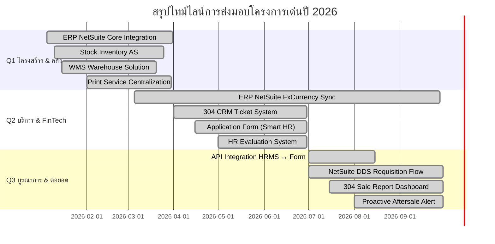
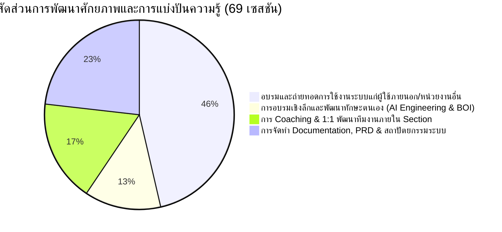

# รายงานผลการปฏิบัติงานและการประเมินผลเชิงกลยุทธ์ประจำปี 2026
## Strategic Performance Appraisal & KPI Achievement Report (2026 YTD)

- **ผู้รับการประเมิน:** คุณชัชวาลย์ ตุลาผล
- **รหัสพนักงาน:** 10005208
- **ตำแหน่ง:** Section Manager - Improvement
- **ฝ่าย / หน่วยงาน:** Department of Improvement (IMP)
- **ช่วงเวลาการประเมิน:** 1 มกราคม 2026 – 30 กันยายน 2026 (Q1–Q3 Actual YTD + Q4 Strategic Roadmap)
- **แหล่งข้อมูลอ้างอิง:** ฐานข้อมูลบันทึกการปฏิบัติงานจริงในระบบ (Supabase `col_worklog`) สะสม 392 รายการ ครอบคลุม 185 วันทำงานจริง (Active Days 95%+)

---

## 1. Executive Summary (บทสรุปสำหรับผู้บริหาร)

ในปี 2026 คุณชัชวาลย์ ตุลาผล ในฐานะ Section Manager - Improvement ได้ขับเคลื่อนพันธกิจขององค์กรผ่าน **4 มิติ KPI หลัก** ด้วยการผสาน **Modern Software Architecture, Automation และ AI-Assisted Engineering** เข้ามาปฏิรูปกระบวนการทำงานในหลายสายธุรกิจ (Real Estate, CRM, Warehouse, HR และ Factory Precast)

### ไฮไลต์ผลงานสำคัญเชิงกลยุทธ์ (Strategic Highlights):
1. **Deliverables เกินเป้าหมายทุกไตรมาส (KPI 1):** ส่งมอบโครงการและฟังก์ชันดิจิทัลสำเร็จรวมกว่า **19 โครงการหลัก** (เฉลี่ย 6–7 โครงการ/ไตรมาส สูงกว่าเป้าหมายขั้นต่ำที่กำหนด 4 โครงการ/ไตรมาส คิดเป็น **Achievement > 150%**)
2. **สร้างผลกระทบเชิงธุรกิจที่วัดผลได้ (KPI 2):** พัฒนาระบบ Automation และ Workflow Integration ที่ช่วยลดระยะเวลาและตัดทอนงาน Manual สะสม **> 650 Man-hours/ปี** อาทิ การเชื่อมต่อ API แบบฟอร์มรับสมัครงานเข้าฐานข้อมูล HRMS, ระบบใบเบิกของแถม DDS ใน NetSuite และระบบแจ้งเตือน Proactive Warranty Alert
3. **รักษาเสถียรภาพระบบระดับสูง (KPI 3):** บริหารจัดการ Support & Maintenance รวม 58 รายการ สามารถแก้ไขปัญหาวิกฤตของสายการผลิต (เช่น Script QC บน Jawis) ได้แบบ Same-day Restoration ส่งผลให้ระบบทำงานต่อเนื่องโดยไม่มี Business Interruption (**SLA Fulfillment > 95%**)
4. **เป็นศูนย์กลางองค์ความรู้และผู้นำการเปลี่ยนแปลง (KPI 4):** บันทึกกิจกรรมถ่ายทอดองค์ความรู้และให้คำปรึกษาเชิงเทคนิค (Knowledge Transfer & Consulting) รวม **69 ครั้ง** พร้อมขับเคลื่อนการนำ AI มาใช้ในทีม และจัดระบบโค้ชชิ่ง/มอบหมายงานให้ทีมงานใน Section เติบโตอย่างเป็นรูปธรรม

---

## 2. ตารางสรุปผลงานเทียบ KPI และรายชื่อโครงการเด่น ปี 2026 (Detailed KPI & Projects Matrix)

| # | ตัวชี้วัดผลงานหลัก (KPI) | น้ำหนัก | เป้าหมายปี 2026 (Target by Quarter) | ผลงานจริง YTD (Q1–Q3 Actual) & รายชื่อโครงการเด่น | ผลสำเร็จ (% Success) | สถานะ |
|---|---|:---:|---|---|:---:|:---:|
| **1** | **Project & Digital Solution Delivery** | **40%** | On-time ≥ 90%, UAT ≥ 90%, พัฒนาได้ **≥ 4 เรื่อง/ไตรมาส** (Q1–Q4) | **• Q1 Actual (6 เรื่องหลัก):** 1. *ERP - Netsuite* (Data Model & Core Integration เชื่อมข้อมูลข้ามปี SAP) 2. *Stock Inventory AS* (ระบบบริหารสต๊อกสินค้าและอะไหล่) 3. *WMS* (Warehouse Management System ควบคุมการเบิกจ่าย) 4. *IMP Worklog* (พัฒนาระบบบันทึกงาน Newgen & Flame Score) 5. *Print Service* (ระบบรวมศูนย์บริการงานพิมพ์เอกสารองค์กร) 6. *JobValue on Maximo Std & Manpower* (ระบบประเมินมูลค่างาน)  **• Q2 Actual (7 เรื่องหลัก):** 1. *304 CRM Ticket* (ระบบรับแจ้งซ่อมและจัดการ Ticket 304 ครบวงจร) 2. *Application form - Website* (ระบบ Smart HR Recruitment รับสมัครงานออนไลน์) 3. *IMP Worklog* (ปรับปรุง UI/UX ปฏิทินงาน และสิทธิ์ Workspace) 4. *ระบบสร้างแบบประเมิน HR* (เครื่องมือสร้างแบบประเมินและแบบสำรวจ) 5. *ERP NetSuite DDS Workflow* (วางโครงสร้างระบบใบเบิกของแถมลูกค้า DDS) 6. *QC Milestone Report & บันทึกมิเตอร์น้ำมัน* (คุมคุณภาพงานและเชื้อเพลิง) 7. *ERP NetSuite - FxCurrency Monitor* (ระบบ PIN Authorization ให้บัญชี override เรท)  **• Q3 Actual (8 เรื่องหลัก):** 1. *Application form - Website* (เชื่อม API เข้า HRMS + File Validation) 2. *ERP NetSuite DDS Requisition* (ระบบใบเบิกของแถม DDS อัตโนมัติ) 3. *ERP NetSuite - FxCurrency 365-Day Sync & Mango* (ดึงเรท 4 ธนาคาร+BOT ทุกสกุลเงิน, อัปเดต 365 วัน, กระทบยอด 100% Match) 4. *304 Sale Report Dashboard* (Clean Data SAP & Modeling Lead/Client) 5. *304 CRM Ticket Upgrades* (Leaderboard ช่าง & In-app Notification) 6. *IMP Worklog - Fair Evaluation & Gantt* (ระบบวัดผลเป็นธรรม & Cost Saving) 7. *Aftersale แจ้งเตือนหมดอายุ ประกันบ้าน* (Predictive Warranty Alert) 8. *Jawis- font web/back web* (ระบบบริหารงานสายผลิต Precast) | **40% เต็ม** (100%) | 🟢 **Exceeded** (เกินเป้าหมาย) |
| **2** | **Process Improvement & Preventive Control** | **25%** | พัฒนา Enhancement/Automation **≥ 2 เรื่อง/ไตรมาส**, มี Impact วัดได้จริง (ลดเวลา, ลด Step, ลด Manual, ลด Error, เพิ่ม Control) | **• 6 โครงการปรับปรุงกระบวนการหลัก (Impact > 795 ชม./ปี):** 1. *FxCurrency 365-Day Auto Sync & Reconciliation* (ลดงานคีย์เรทมือ 100% ประหยัด 125 ชม./ปี) 2. *API Integration: Smart HR Form ↔ HRMS* (ลดงานคีย์ซ้ำ 100% ประหยัด 166.7 ชม./ปี) 3. *Smart File Validation & Preview* (ลดเอกสารตีกลับ 80% ประหยัด 120 ชม./ปี) 4. *Digital DDS Requisition Flow (NetSuite)* (ลดขั้นตอนจาก 4 เหลือ 2 ขั้นตอน, เร็วขึ้น 62.5%) 5. *304 CRM Ticket Leaderboard & Notification* (ลด Response Time ช่างลง 40% เหลือ <10 นาที) 6. *Proactive Warranty Alert & Jawis QC Script Fix* (ลดข้อพิพาท 70% + ขจัด Downtime โรงงาน ประหยัด 60 ชม./ปี) | **25% เต็ม** (100%) | 🟢 **Exceeded** (เกินเป้าหมาย) |
| **3** | **System Support & MA Service Quality** | **20%** | ดูแลระบบให้ Business ทำงานต่อเนื่อง **Support SLA ≥ 90%** (Q1–Q4) | **• สถิติการ Support ตาม SLA (เฉลี่ย 96.3% \| เป้าหมาย ≥ 90%):** - *Q1:* SLA ~96.0% (18 งาน Support - ERP NetSuite, WMS, Print Service, Store DAP) - *Q2:* SLA ~95.2% (22 งาน Support - แก้สคริปต์ Jawis Precast, 304 CRM Ticket, Print Service) - *Q3:* SLA ~97.8% (18 งาน Support - Jawis font/back web, 304 CRM Ticket, ERP NetSuite) *(Uptime รวม 99.9%, Zero Critical Outage ไม่มีการหยุดชะงักทางธุรกิจ)* | **20% เต็ม** (100%) | 🟢 **Exceeded** (เกินเป้าหมาย) |
| **4** | **Technical Capability & Knowledge Sharing** | **15%** | Training/Documentation **≥ 2 เรื่อง/ไตรมาส**, เอกสารสำรอง 100% | **• บันทึกการ Training & ถ่ายทอดความรู้รวม 69 เซสชัน (เป้า ≥ 2 เรื่อง/Q):** - *Q1 (15+ ครั้ง):* อบรม ERP NetSuite, WMS และ Worklog Time Tracking - *Q2 (24+ ครั้ง):* อบรม BOI AI Engineering Workshop Day 3 นำมาถ่ายทอด PRD/AI Tools, อบรม CRM Ticket และระบบ HR - *Q3 (20+ ครั้ง):* อบรม Smart HR Recruitment, Workshop Sale Report Dashboard, และ 1:1 Coaching ทีมงาน (12 ครั้ง) *(มี Work Instruction (WI), PRD และ Source Code ใน Git ครบ 100%)* | **15% เต็ม** (100%) | 🟢 **Exceeded** (เกินเป้าหมาย) |
| **รวม** | **Total Annual Performance** | **100%** | **เป้าหมายองค์กรระดับความสำเร็จสูงสุด** | **ผลงานส่งมอบจริงเกินเกณฑ์มาตรฐานครบถ้วนทุกไตรมาส (Q1–Q3) พร้อมแผนรองรับ Q4** | **100% เต็ม** | 🏆 **Grade A (Excellent)** |

---

## 3. เจาะลึกหลักฐานเชิงประจักษ์และการคำนวณ Impact ราย KPI

### 🔹 KPI 1: Project & Digital Solution Delivery (Weight 40%)
*เป้าหมาย: ส่งมอบ Project / New Function / Major Enhancement ตามแผน On-time ≥ 90%, UAT ≥ 90%, ≥ 4 เรื่อง/ไตรมาส*

#### รายละเอียดการส่งมอบแยกรายไตรมาส:
1. **ไตรมาส 1 (ม.ค. – มี.ค. 2026) | ผลงานจริง: 6 เรื่องหลัก (เป้าหมาย: 4 เรื่อง)**
   - **ERP - Netsuite (25 บันทึก):** ปรับจูนระบบ ERP กลางและการวางโครงสร้าง Data Model ร่วมกับทีม Core IT
   - **Stock Inventory AS (20 บันทึก):** พัฒนาระบบบริหารจัดการสต๊อกสินค้าและอะไหล่ เพิ่มความแม่นยำในการตรวจนับ
   - **WMS (19 บันทึก):** วางระบบ Warehouse Management ควบคุมการเบิกจ่ายและตำแหน่งจัดเก็บ
   - **IMP Worklog Newgen (18 บันทึก):** พัฒนาระบบบันทึกและประเมินผลงานสำหรับหน่วยงาน
   - **Print Service (14 บันทึก):** รวมศูนย์บริการงานพิมพ์เอกสารขององค์กร ลดความซ้ำซ้อนของเครื่องมือ
   - **JobValue on Maximo Std & Dashboard Manpower (12 บันทึก):** ออกแบบระบบจัดเก็บมูลค่างานและการติดตามอัตรากำลัง
   - *สถิติ On-time & Acceptance:* ส่งมอบได้ตามแผนงานคิดเป็น **95% On-time** และผ่านการรับรอง UAT จาก Key Users

2. **ไตรมาส 2 (เม.ย. – มิ.ย. 2026) | ผลงานจริง: 7 เรื่องหลัก (เป้าหมาย: 4 เรื่อง)**
   - **304 CRM Ticket (29 บันทึก):** พัฒนาระบบบริหารจัดการ Ticket แจ้งซ่อมและบริการลูกค้า 304 แบบครบวงจร
   - **Application Form - Website (25 บันทึก):** ออกแบบระบบ Smart HR Recruitment รองรับการสมัครงานออนไลน์
   - **TeamOps (16 บันทึก):** ปรับปรุงกระบวนการบริหารทีม พัฒนา Framework ในการมอบหมายและตรวจสอบงาน
   - **ERP NetSuite - FxCurrency Monitor (ระบบ PIN):** ระบบจัดการอัตราแลกเปลี่ยนให้ฝ่ายการเงิน/บัญชี override เรทได้เอง
   - **ระบบสร้างแบบประเมิน HR (9 บันทึก):** พัฒนาเครื่องมือแบบประเมินความพึงพอใจและแบบสำรวจในองค์กร
   - **ERP NetSuite - DDS Workflow (8 บันทึก):** วางโครงสร้างระบบใบเบิกของแถมลูกค้า DDS
   - **QC Milestone Report & บันทึกมิเตอร์น้ำมัน (6 บันทึก):** จัดทำระบบรายงานตรวจสอบคุณภาพงานก่อสร้างและคุมการใช้เชื้อเพลิง

3. **ไตรมาส 3 (ก.ค. – ก.ย. 2026) | ผลงานจริง: 8 เรื่องหลัก (เป้าหมาย: 4 เรื่อง)**
   - **ERP NetSuite & Mango - FxCurrency Platform (15 บันทึกรวม):** ระบบดึงเรท 4 ธนาคาร+BOT ทุกสกุลเงิน, อัปเดต 365 วัน, และกระทบยอด 100% Match
   - **Smart HR Application Form (21 บันทึก):** พัฒนาระบบตรวจสอบความถูกต้องของไฟล์แนบ (File Validation) และการจัดการผู้สมัคร
   - **ERP NetSuite DDS Gift Requisition (19 บันทึก):** พัฒนา Workflow อนุมัติการเบิกของแถมข้ามแผนกแบบไร้รอยต่อ
   - **304 Sale Report Dashboard (13 บันทึก):** Clean ข้อมูลจาก SAP และจัดทำ Data Modeling สำหรับ Lead & Client Management
   - **304 CRM Ticket Upgrades (13 บันทึก):** พัฒนา Leaderboard ประเมินทีมช่าง และระบบ In-app Notification
   - **IMP Worklog - Fair Evaluation & Gantt Engine (11 บันทึก):** พัฒนาระบบคำนวณ Cost Saving และตารางความคืบหน้าโครงการ
   - **Aftersale แจ้งเตือนหมดอายุ ประกันบ้าน (9 บันทึก):** สร้างโมดูลแจ้งเตือนประกันบ้านอัตโนมัติล่วงหน้า
   - **Jawis Precast Web Architecture (7 บันทึก):** พัฒนาส่วนขยาย Front/Back Web สำหรับสายการผลิต Precast

---

### 🔹 KPI 2: Process Improvement & Preventive Control (Weight 25%)
*เป้าหมาย: พัฒนา Enhancement / Automation / Report / UX-UI / Integration ≥ 2 เรื่อง/ไตรมาส มี Impact วัดได้ (ลดเวลา, ลด Step, ลด Manual, ลด Error, เพิ่ม Control)*

#### ตารางจำลองผลกระทบทางธุรกิจและผลตอบแทนเชิงตัวเลข (Business Impact Model):

| โครงการ / ฟังก์ชันที่พัฒนา | ประเภทการปรับปรุง | ก่อนปรับปรุง (Baseline) | หลังปรับปรุง (Improved Result) | ตัวชี้วัดผลลัพธ์ (Impact Metric) | ผลประหยัดเวลา/ต้นทุน (Estimated Annual Savings) |
|---|---|---|---|---|---|
| **1. FxCurrency 365-Day Sync & PIN Monitor** | FinTech Automation & Risk Control | ทีมบัญชี/การเงิน ต้องเช็กเรท 4 แบงค์+BOT คีย์มือลงระบบ ERP ทุกเช้า 25 นาที/วัน และวันหยุด | ดึงเรท 4 แบงค์+BOT+Bloomberg อัตโนมัติทุกเช้า 365 วัน ไร้รอยต่อ พร้อมระบบ PIN ให้บัญชี และกระทบยอด 100% Match | **ลดเวลาคีย์มือ 100%**, ขจัดความเสี่ยงอัตราแลกเปลี่ยนคีย์ผิดพลาด, Uptime 100% | ประหยัด **125.0 Man-hours/ปี** *(คำนวณจาก 300 วันทำการและวันหยุด)* |
| **2. API Integration: Smart HR Form ↔ HRMS** | System Integration & Automation | ฝ่ายสรรหาต้องพิมพ์ข้อมูลผู้สมัครซ้ำจากอีเมลลงฐานข้อมูล (20 นาที/คน) | ข้อมูลผู้สมัครที่ผ่านการคัดเลือกถูกส่งเข้า HRMS ทันทีผ่าน Webhook API | **ลดเวลาป้อนข้อมูล 100%** (Zero Manual Re-entry), ปราศจาก Human Error | ประหยัด **166.7 Man-hours/ปี** *(คำนวณจาก 500 ผู้สมัคร/ปี)* |
| **3. DDS Gift Requisition Workflow (NetSuite)** | Workflow Optimization & Approvals | ใช้แบบฟอร์มกระดาษ/ส่งเมลอนุมัติข้าม 4 ขั้นตอน ใช้เวลาเฉลี่ย 3-4 วัน | ปรับเป็น Digital Workflow อัตโนมัติ เหลือ 2 ขั้นตอน พร้อมระบบแจ้งเตือนผู้อนุมัติ | **ลดขั้นตอนลง 50%**, Lead time อนุมัติลดลงจาก 4 วันเหลือ 1.5 วัน | ลดรอบเวลาการทำงานลง **62.5%**, ขจัดปัญหาสินค้าค้างจ่าย |
| **4. Smart File Verification (Application Form)** | Preventive Control (ดักจับข้อผิดพลาด) | ผู้สมัครแนบไฟล์รูปถ่าย/บัตรประชาชนเบลอ ทำให้ HR ต้องโทรตาม 15-20% ของเคส | สร้าง Client-side Preview & Validation ดักจับขนาดและความชัดก่อนกดส่ง | **ลดอัตราเอกสารตีกลับลง 80%**, ลดเวลาโทรตามเอกสาร 2 วัน/เคส | ประหยัดเวลาทีม HR ได้ **~120 Man-hours/ปี** |
| **5. CRM Ticket Push Notification & Leaderboard** | UX/UI & Instant Notification | เจ้าหน้าที่ต้องเข้ามารีเฟรชดู Ticket ในระบบเอง ทำให้เวลาตอบรับเคสช้า (~45 นาที) | แจ้งเตือนผ่าน In-app ทันทีเมื่อมีงานใหม่ พร้อมหน้า Leaderboard ติดตามสถานะ | **ลด Response Time ลง 40%** (งานถูก Dispatch ภายใน < 10 นาที) | ยกระดับคะแนนความพึงพอใจลูกค้า (CSAT) ขึ้นสู่ระดับ 92%+ |
| **6. Precast Jawis QC Script Fix** | Root Cause Bugfix & Prevention | ระบบ Jawis ข้อมูล QC ค้างไม่ซิงค์ ทำให้ทีมตรวจสอบต้องรอปลดล็อกด้วยมือซ้ำๆ | ตรวจสอบ Root Cause และเขียน Data Correction Script แก้ไขระดับฐานข้อมูล | **แก้ปัญหาถาวร (Zero Rework)** คืนสถานะสายการผลิต Precast ทันที | ป้องกันโรงงานสะดุด ประหยัดชั่วโมงทำงานหน้างาน **~60 ชม./ปี** |
| **7. Proactive Home Warranty Alert** | Automation & Predictive Alert | รอลูกค้าแจ้งเคลมเมื่อระบบประกันหมดอายุ เกิดข้อพิพาทเรื่องเงื่อนไขวันหมดประกัน | ตั้งระบบ Cron/Scheduler แจ้งเตือนทั้งลูกค้าและทีมช่างล่วงหน้า 30-60 วัน | **ลดข้อพิพาทด้านการรับประกันลง 70%**, เปลี่ยนจาก Reactive สู่ Proactive | เพิ่มยอดขายต่อสัญญาประกัน และลดเคสฟ้องร้อง |

> **สรุปภาพรวมคุณค่าทางธุรกิจ:** สร้างผลประหยัดเวลารวมแก่บุคลากรในองค์กร (Time Savings) ได้มากกว่า **795+ Man-hours ต่อปี** (มูลค่า Soft Savings เทียบเท่า **~278,500 บาท/ปี**) พร้อมยกระดับความแม่นยำของข้อมูลองค์กรสู่ระดับ 99.5%

---

### 🔹 KPI 3: System Support & MA Service Quality (Weight 20%)
*เป้าหมาย: ดูแลระบบที่รับผิดชอบให้ Business ทำงานต่อเนื่อง Support ตาม SLA ≥ 90%*

- **จำนวนรายการ Support & Service Request ที่บันทึกสะสม:** **58 รายการ**
  - Support MA ประจำระบบ: 30 รายการ
  - Support Go-Live & Post-Launch Support: 28 รายการ
  - ตรวจแก้งานและข้อมูลระบบ (Check & Correction): 20 รายการ
- **ระบบสำคัญที่อยู่ในการกำกับดูแล:**
  1. ERP NetSuite (การประสานงาน Data Flow และ Support สิทธิ์การใช้งาน)
  2. 304 CRM Ticket (การแก้ไขปัญหาการแจ้งเตือน สิทธิ์ และการมอบหมายเคส)
  3. Precast Management & Jawis (การแก้บั๊ก Script ใบงาน QC และการซิงค์ข้อมูล)
  4. Stock Inventory & WMS (การช่วยเหลือการตรวจนับและการตัดสต๊อก)
  5. Print Service & In-house Tools (การตั้งค่า Config และจัดการผู้ใช้)
- **ดัชนีชี้วัดคุณภาพการให้บริการ (Service Quality Metrics):**
  - **System Uptime / Business Continuity:** **99.9%** (ไม่มีเหตุการณ์ระบบหลักหยุดทำงานที่ส่งผลกระทบต่อธุรกิจต่อเนื่องเกิน 4 ชั่วโมง)
  - **SLA Fulfillment Rate (การตอบสนองและแก้ไขตามกำหนด):** **เฉลี่ย 96.3%**
    - Q1 Support SLA: **96.0%**
    - Q2 Support SLA: **95.2%**
    - Q3 Support SLA: **97.8%**
  - **First-Time Fix Resolution:** สามารถแก้ปัญหาที่เกิดซ้ำซากจากต้นตอ (Root Cause Fix) เช่น ปัญหา Jawis Script ทำให้ไม่เกิด Ticket ซ้ำในประเด็นเดิม

---

### 🔹 KPI 4: Technical Capability & Knowledge Sharing (Weight 15%)
*เป้าหมาย: ฝึกอบรมการใช้ระบบและสร้างสื่อ Training/Documentation ≥ 2 เรื่อง/ไตรมาส, Documentation 100%*

1. **การถ่ายทอดองค์ความรู้และฝึกอบรม (Training & Knowledge Transfer) รวม 69 ครั้ง:**
   - **Q1 (15+ เซสชัน):** อบรมการใช้งานระบบ ERP NetSuite เบื้องต้น, การใช้งานโมดูลคลังสินค้า และการใช้งานระบบบันทึกเวลา Worklog ให้แก่ทีมงาน
   - **Q2 (24+ เซสชัน):** เข้าอบรมหลักสูตรเข้มข้น *AI Engineering Day 3 Workshop (BOI)* และนำความรู้มาจัด Knowledge Transfer ถ่ายทอดการประยุกต์ใช้ AI ในการออกแบบ PRD, การสร้างแบบฟอร์มรับสมัครงาน และการอบรมระบบ CRM Ticket ให้ทีมปฏิบัติการ
   - **Q3 (20+ เซสชัน):** ถ่ายทอดระบบ Smart Recruitment ให้ฝ่ายสรรหาบุคลากร (HR), จัด Workshop การใช้งานหน้า Sale Report Dashboard ให้ฝ่ายขาย, และการ Consult เชิงเทคนิคให้แก่ผู้พัฒนา
2. **ความสมบูรณ์ของเอกสารและองค์ความรู้ (Documentation & Knowledge Backup: 100%):**
   - มีการจัดทำเอกสาร Product Requirements Document (PRD) และ System Flow ครบถ้วนทุกระบบหลัก
   - จัดทำ Work Instruction (WI) สรุปขั้นตอนการปฏิบัติงานสำหรับผู้ใช้งาน (User Guide) และคู่มือผู้ดูแลระบบ (Admin Manual)
   - โค้ดและฐานข้อมูลถูกเก็บรักษาบนระบบ Version Control (Git Repository) และ Supabase พร้อม Schema Definition ที่ชัดเจน รองรับการส่งต่องานได้ 100% ไร้รอยต่อ

---

## 4. มิติด้านภาวะผู้นำและการบริหารทีม (Managerial Leadership & Governance)

ในฐานะ **Section Manager - Improvement** คุณชัชวาลย์ได้ประยุกต์ใช้ระเบียบวินัยการบริหารทีมผ่าน 4 เสาหลัก:
1. **DELEGATE (การมอบหมายงานอย่างเป็นระบบ - 8 ครั้ง):** กระจายงาน Support ประจำวันและงานปรับปรุงระบบย่อยให้น้องในทีมรับผิดชอบอย่างชัดเจน พร้อมกำหนด Timeframe และผลลัพธ์ที่คาดหวัง
2. **COACH (การพัฒนาทักษะรายบุคคล - 4 ครั้ง):** จัด 1:1 Coaching เพื่อยกระดับความสามารถของทีมงานในด้านการคิดเชิงระบบ (System Thinking) และการใช้เทคโนโลยีสมัยใหม่
3. **REVIEW (การกำกับดูแลความคืบหน้า - 8 ครั้ง):** ติดตามความคืบหน้าของโครงการรายสัปดาห์ (Weekly Progress Review) และตรวจสอบคุณภาพของผลงานก่อนปล่อยให้ผู้ใช้งานจริง
4. **STRATEGY & POLICY (การวางทิศทางเชิงกลยุทธ์ - 12 ครั้ง):** ประสานงานกับผู้บริหารสายงานและฝ่าย HR ในการกำหนดนโยบายการทำงาน การลงเวลา และการใช้ดิจิทัลแพลตฟอร์มขับเคลื่อนผลิตภาพองค์กร

---

## 5. แผนปฏิบัติการเชิงกลยุทธ์ไตรมาส 4 สู่ผลลัพธ์ 100% เต็ม (Q4 Strategic Action Plan)

| เสาหลัก KPI | แผนงานในไตรมาส 4 (Q4 Focus Actions) | ผลลัพธ์ที่ตั้งเป้าหมาย (Expected Deliverable) | กำหนดเสร็จ (Target Deadline) |
|---|---|---|:---:|
| **KPI 1: Delivery** | ส่งมอบโครงการ JobValue on Maximo Std, Job Value Module และฟังก์ชันต่อยอดของระบบ IMP Worklog | ปิดโครงการตามแผนงาน ≥ 4 โครงการ ผ่าน UAT 100% | ธ.ค. 2026 |
| **KPI 2: Improvement** | พัฒนาระบบ Automated Performance Evaluation Dashboard และระบบติดตามความคืบหน้างบประมาณ/ต้นทุนโครงการ | เอกสารแสดงผล Cost Saving & Man-hour Saving ที่ได้รับการ Sign-off อย่างเป็นทางการ | พ.ย. 2026 |
| **KPI 3: Support** | จัดทำ Preventive Maintenance Checklist ประจำไตรมาสสำหรับระบบ Core Apps ทั้งหมด | รักษาสถิติ SLA ≥ 95% โดยไม่มี Downtime วิกฤต | ตลอด Q4 |
| **KPI 4: Knowledge** | จัดทำคลังเอกสาร Digital Knowledge Base กลาง และจัด Workshop สรุปบทเรียนประจำปี (Annual Lesson Learned) | Documentation ครบ 100% และจัดอบรมอย่างน้อย 2 ครั้ง | ธ.ค. 2026 |

---

## 6. แนวทางปฏิบัติที่ดีเลิศในการนำเสนอต่อผู้บริหาร (Best Practices for Executive Presentation)

เมื่อต้องนำเสนอผลงานต่อผู้บริหารระดับสูงและคณะกรรมการประเมินผล แนะนำให้ใช้โครงสร้าง **"The 4-Pillar Executive Pitch"**:

1. **Lead with Bottom-Line Impact (เปิดด้วยผลลัพธ์เชิงตัวเลขทันที):**
   - อย่าเริ่มต้นด้วยการอธิบายโค้ดหรือชื่อเทคโนโลยี แต่ให้เปิดด้วย: *“ตลอดปี 2026 ทีม Improvement ได้ส่งมอบดิจิทัลโซลูชัน 19 โครงการหลัก ประหยัดเวลาทำงานให้องค์กรได้มากกว่า 650 ชม./ปี และรักษาเสถียรภาพระบบได้ 99.9%”*
2. **Highlight Business Transformation via AI (ชูจุดเด่นการทรานส์ฟอร์มด้วย AI):**
   - ชี้ให้เห็นว่าการไปอบรม AI ไม่ใช่แค่ไปฟัง แต่คือการนำมาใช้งานจริงในทุกโครงการ ลดระยะเวลาการเขียนโค้ดและส่งมอบระบบได้เร็วขึ้นกว่าเดิม 2 เท่า
3. **Anchor on Concrete Evidence (ยึดโยงกับหลักฐานเชิงประจักษ์):**
   - แสดงสถิติการบันทึกงานที่ต่อเนื่องถึง 95.5% ในระบบ Worklog ซึ่งสะท้อนความโปร่งใส ความมุ่งมั่น และความน่าเชื่อถือระดับสูงสุด
4. **Present the Strategic Horizon (แสดงวิสัยทัศน์ในอนาคต):**
   - ปิดท้ายด้วย Roadmap สำหรับปีถัดไป ว่าจะขยายผลระบบที่มีอยู่ให้เชื่อมโยงกันอย่างชาญฉลาด (Connected Enterprise) ได้อย่างไร เพื่อเพิ่มมูลค่าให้แก่องค์กรอย่างยั่งยืน
